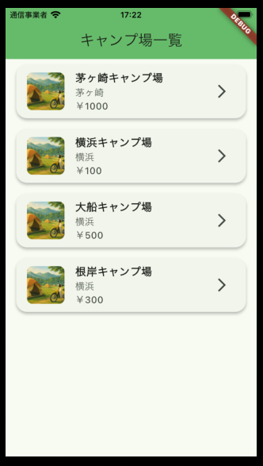
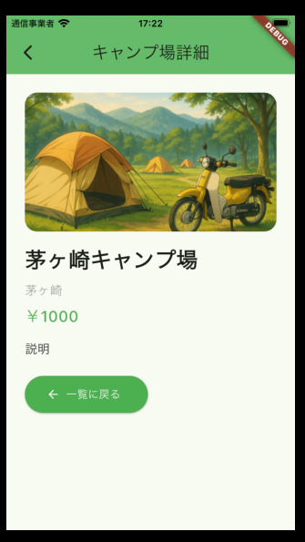

# Campsite App

This is a Flutter demo app.  
You will need the backend API from [campsite_go](https://github.com/ttsukahara967/campsite_go) to run this app.

---

## List Screen

---

## Detail Screen

---

## Setup

1. Clone this repository.
2. Make sure the image files are placed under `img/campsite/`.
3. Run `flutter pub get` to install dependencies.
4. Start the [campsite_go](https://github.com/ttsukahara967/campsite_go) backend server.
5. Run the Flutter app.

---

## Notes

- This app is a demo for API integration using Flutter.
- Feel free to customize or fork this project!