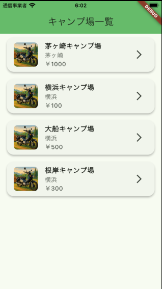
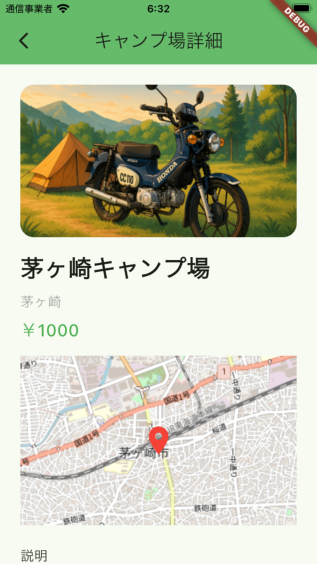

# Campsite App

これはFlutterのデモアプリです。  
バックエンドAPIは [campsite_go](https://github.com/ttsukahara967/campsite_go) をご利用ください。

---

## 一覧画面

---

## 詳細画面

---

## セットアップ

1. このリポジトリをクローン
2. 必要に応じて `pubspec.yaml` の `assets` 設定や依存パッケージを `flutter pub get`
3. 画像は `img/screenshot/` 配下に入れてください
4. [campsite_go](https://github.com/ttsukahara967/campsite_go) サーバーを起動して、Flutterアプリを実行

---

## 補足

- このアプリはAPI連携の動作デモ用です
- ご自由にカスタマイズ・Forkどうぞ！

